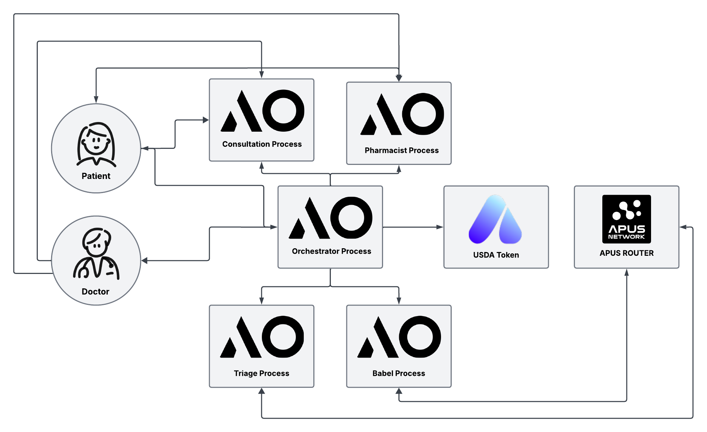

# ConsultifyAO

A decentralized telemedicine platform built on Arweave/AO that connects patients with medical professionals across language barriers through AI-powered triage and real-time translation.

You can try it out at [ConsultifyAO](https://consultifyao.vercel.app)

## Features

- **AI-Powered Triage**: Automated initial assessment to match patients with appropriate specialists
- **Real-Time Translation**: Seamless communication across 8 languages (English, Spanish, French, German, Italian, Portuguese, Chinese, Japanese)
- **14 Medical Specialties**: From general medicine to specialized fields like cardiology, dermatology, and surgery
- **Autonomous Pharmacy**: Smart contract-based prescription management with automatic medication reminders
- **Stake-Based Doctor Assignment**: Weighted selection system ensuring quality care
- **Blockchain Security**: All interactions permanently stored on Arweave for privacy and verification

## Quick Start

### Prerequisites

- Web browser (Chrome/Firefox recommended)
- Arweave wallet (Wander Wallet or ArConnect)
- USDA tokens (available via faucet for testing)

### For Patients

1. Connect your Arweave wallet
2. Select your preferred language
3. Get USDA tokens from the faucet (50 tokens for testing)
4. Start a new consultation (5 USDA fee)
5. Complete AI triage assessment
6. Chat with your assigned doctor through translated messaging
7. Receive digital prescriptions with automated reminders

### For Doctors

1. Register with your medical specialty
2. Stake USDA tokens (minimum 5 USDA)
3. Get automatically assigned to matching patient consultations
4. Communicate through real-time translation
5. Issue digital prescriptions recorded on arweave

## Architecture



ConsultifyAO consists of five interconnected AO processes:

- **Orchestrator**: Central registry managing users, payments, and assignments
- **Triage**: AI-powered patient assessment and specialist matching
- **Consultation**: Real-time patient-doctor communication platform
- **Babel**: Translation service with blockchain attestation
- **Pharmacist**: Autonomous prescription management and medication reminders

## Processes in Depth

### Orchestrator Process
The central hub that manages the entire platform ecosystem. Handles user registration for both patients and doctors, manages USDA token operations including staking and withdrawals, and orchestrates consultation creation. Features a weighted doctor assignment system based on specialty matching and stake amounts, plus a faucet system for test tokens. Also manages notifications and provides comprehensive user data retrieval across all consultations.

### Triage Process  
An AI-powered medical assessment system that conducts automated interviews with patients. Uses a specialized prompt to ask 2-4 targeted questions, maintaining conversation language consistency while gathering essential symptom information. Determines the most appropriate medical specialty from 14 available options and provides concise triage summaries including symptom details, timeline, and severity assessment for seamless doctor handoff.

### Consultation Process
The core communication platform managing real-time conversations between patients and doctors. Handles state transitions through three phases: TRIAGE (AI assessment), DOCTOR (human consultation), and PRESCRIPTION (medication management). Routes messages appropriately based on current state, coordinates with translation services, and maintains complete conversation history with translation metadata for all participants.

### Babel Process
A specialized translation service providing real-time multilingual communication. Supports 8 languages with medical terminology accuracy, processing translation requests through AI inference. Maintains strict JSON formatting for reliable parsing and ensures consistent language codes across the platform. Critical for enabling seamless doctor-patient communication regardless of language barriers.

### Pharmacist Process
An autonomous medication management system that operates 24/7 without human intervention. Records prescription details from doctors, calculates medication schedules based on frequency requirements, and sends automated reminders to patients in their preferred language. Uses AO's cron system for reliable scheduling and manages prescription history for comprehensive medication tracking.

## Technology Stack

- **Blockchain**: Arweave/AO protocol
- **Lua-based AO processes**
- **Translation**: AI-powered multilingual support
- **Payment**: USDA token integration
- **Storage**: Decentralized data storage on Arweave

## Consultation Flow

```
Patient Creates → AI Triage → Doctor Assignment → Translated Chat → Digital Prescription → Automated Reminders
```

Each consultation progresses through three states:
1. **TRIAGE**: AI assessment (2-4 questions)
2. **DOCTOR**: Direct patient-doctor communication
3. **PRESCRIPTION**: Autonomous medication management

## Getting Started

Visit the ConsultifyAO platform and follow the quickstart guide to begin your decentralized healthcare journey. Experience barrier-free medical consultations with global reach and blockchain security.

## Documentation

For comprehensive documentation, including detailed API references, full process specifications, and advanced usage guides, visit our [Documentation website](consultifyao-docs.vercel.app)
