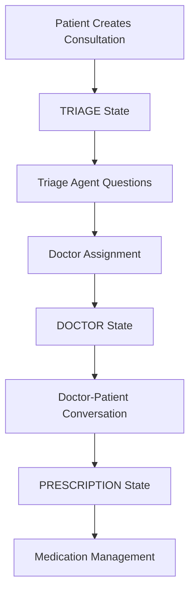

# Consultation

## Anatomy of a Consultation

A consultation represents a complete medical interaction between a patient and doctor, managed through multiple states and processes. Each consultation is a separate process instance in the AO network.

### Consultation Structure

```lua
Consultation = {
  patient_id = "patient_process_id",
  doctor_id = "doctor_process_id", -- nil until doctor assigned
  state = "TRIAGE", -- "TRIAGE" | "DOCTOR" | "PRESCRIPTION"
  created_at = 1725291600,
  patient_language = "en",
  doctor_language = "es" -- nil until doctor assigned
}
```

### Consultation States

The consultation progresses through three distinct states:

#### 1. TRIAGE State
- **Purpose**: Initial patient assessment and symptom gathering
- **Active Process**: Triage agent conducts automated medical interview
- **Duration**: 2-4 questions to determine appropriate specialty
- **Outcome**: Doctor specialty selection and assignment request

#### 2. DOCTOR State  
- **Purpose**: Direct communication between patient and assigned doctor
- **Active Process**: Real-time translated conversation
- **Participants**: Patient and doctor with Babel translation service
- **Activities**: Diagnosis, treatment recommendations, prescription writing

#### 3. PRESCRIPTION State
- **Purpose**: Prescription management and medication reminders
- **Active Process**: Pharmacist process handles medication scheduling
- **Features**: Automated reminders, dosage tracking, multilingual notifications

### Consultation Lifecycle



### Key Features

- **Multilingual Support**: Automatic translation between patient and doctor languages
- **Process Isolation**: Each consultation runs as independent AO process
- **State Management**: Clear progression through medical care stages  
- **Message History**: Complete conversation log with translations
- **Permission System**: Access control for participants and system processes
